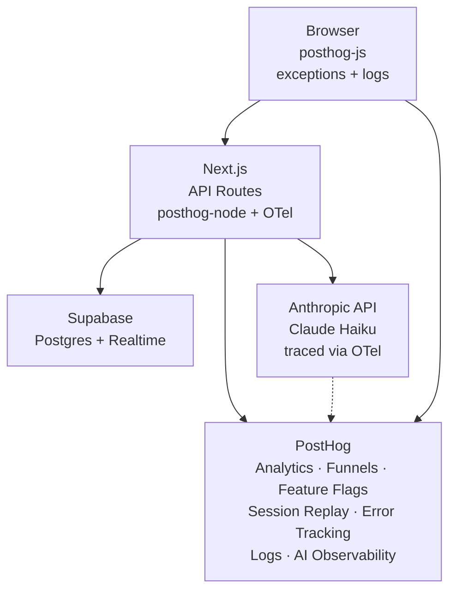

# What are we building?

A hedgehog adoption site that instruments everything: funnels, feature flags, AI chat, error tracking, and logs — all flowing into PostHog. Then we use that data to make the product better, live on stage.

## The problem

You shipped a feature. Users aren't converting. You open three different tools, correlate timestamps manually, and guess what went wrong. What if everything was in one place and you could fix it with a feature flag toggle?

## The building blocks

- **Next.js + Supabase** — the app: hedgehog profiles, adoption flow, realtime chat
- **Claude Haiku** — powers Max, the AI adoption assistant, with streaming responses via Supabase Realtime
- **PostHog** — analytics, funnels, feature flags, session replay, error tracking, logs, and AI observability. One platform.

## Architecture

