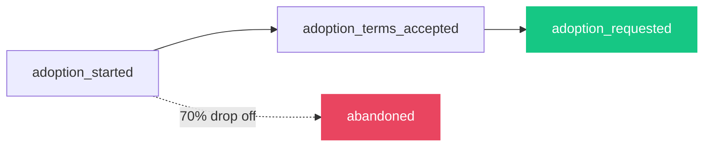

# Lesson 1: Funnels tell you WHERE, not WHY

The adoption funnel has 3 events:

The funnel showed 70% drop-off at the terms step. But it doesn't tell you **why**.

Session replay does. You watch a user read the terms, scroll down, hesitate, and close the dialog.

The combination is what makes it useful: **funnels find the problem, session replay explains it, feature flags test the fix.**

One platform. No context-switching between tools.
