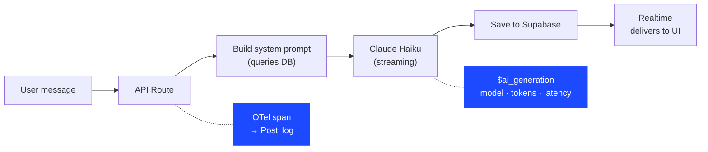

# Lesson 3: AI chat needs observability too

The chatbot (Max) uses Claude Haiku with streaming. Every conversation is traced:

What you can see in PostHog:
- Which hedgehogs users ask about most
- Average response latency and time-to-first-token
- Token usage per conversation
- Whether the chatbot is hallucinating (check `$ai_output_choices`)

**You wouldn't ship an API without monitoring. Don't ship an AI feature without it either.**
