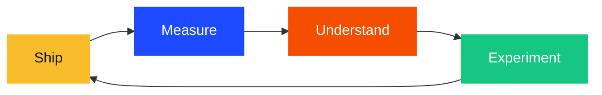

# The takeaway

This entire app — hedgehog adoption site with AI chatbot, realtime streaming, adoption funnel, feature flags, error tracking, logs, and AI observability — was built in one session.

PostHog isn't just analytics. It's the feedback loop:

All in one tool. No stitching together 5 SaaS products. No correlating user IDs across platforms.

**The best product decisions come from seeing the full picture. PostHog gives you the full picture.**

---

## Resources

- This demo: github.com/PostHog/hedgehug
- PostHog docs: posthog.com/docs
- Feature flags: posthog.com/docs/feature-flags
- AI observability: posthog.com/docs/ai-engineering
- Error tracking: posthog.com/docs/error-tracking
